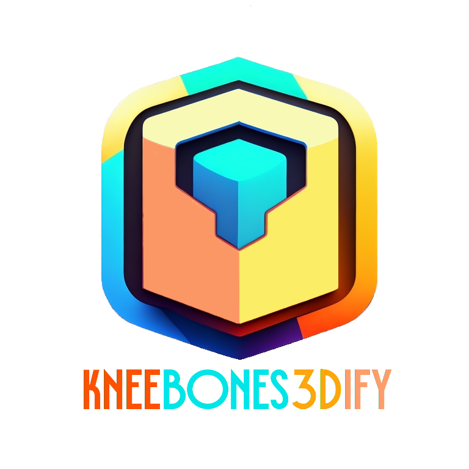

# KneeBones3Dify

# Overview
KneeBones3Dify software offers automatic tools for segmenting and reconstructing knee bones from MR images. It is designed for orthopedic research and clinical practice and aims to facilitate MRI analysis of in vivo biomechanics for knee pathologies. Since manual segmentation of the regions of interest from MR images is time-consuming, labor-intensive, and lacks reproducibility, our software offers accurate segmentation with easy separation of bones and tissues. Additionally, the software provides 3D reconstruction capabilities, enabling the creation of patient-specific models for preoperative analysis in knee replacement surgery.

# Pipeline

## Bones Segmentation
### Pre-processing
The pre-processing stage aims to standardize the volume view of MR images, focus on the region of interest (ROI), and enhance the contours of the bones. Firstly, we transform the original MR images into their sagittal view to improve the visibility of the smallest bone, the patella. Secondly, we determine the ROI as the subset of the image volume that includes intensity values greater than a threshold (**Intensity Threshold** parameter), excluding the black regions surrounding the bones. This step reduces computational complexity and focuses on relevant information. Lastly, we apply a morphological erosion operation to enhance the dark contours of the knee bones in the unsaturated MR images.
### Segmentation
The segmentation process begins by applying the threshold computed by the Otsu algorithm to separate the MR image into two regions: bones and everything else in the knee. Actually, the pre-processed image segmentation result consists of white pixels representing bone and tissue regions, while black pixels correspond to background areas. The subsequent steps aim to separate the bones and tissue areas by selecting rough image volumes that contain the prominent three bones (tibia, femur, and patella). We eliminate image edges through erosion and select the two connected components with the highest volume and extent. We also apply a similar procedure to segment the smaller patella region, bounded by the femur and tibia regions. To obtain a finer segmentation, we dilate the convex hulls of the rough areas (**Convex Hull Dilation** parameter) and apply a similar segmentation procedure to a less eroded version of the initial mask.
### Post-processing
We perform post-processing steps to refine the segmentation results. These steps involve closing to fill boundary regions (**Final Closing** parameter), opening to remove protrusions (**Protrusion Removal** parameter), and dilation to fill borders (**Final Dilation** parameter).

## Creation of the 3D Model
To create a printable 3D model in the Standard Triangulation Language (STL) format, we implement a scaling procedure to ensure the correct dimensions of the segmented volume. Indeed, the printing software interprets STL files in millimeters, where each unit corresponds to a voxel. We then use the segmented volume to extract the isosurface (mesh) representing a threshold image intensity value. Additionally, we implement a smoothing mesh procedure to improve the printed object's visual quality and mechanical properties. To this end, we apply Laplacian smoothing, using inverse vertex distances as weights to adjust vertex positions and minimize surface distortion. This process reduces irregularities and roughness while preserving the general shape and features of the model, resulting in enhanced overall quality.

## Input Parameters refinement

After the 3D model creation, users can change any input parameters. Consequently, the software pipeline will restart from the corresponding intermediate state.

# Setup for Ubuntu Linux OS

## 1) Update : 
	sudo apt update
  
## 2) Install dependencies:
    sudo apt install build-essential zlib1g-dev libncurses5-dev libgdbm-dev libnss3-dev libssl-dev libreadline-dev libffi-dev python-tk python3-tk tk-dev python3-pil python3-pil.imagetk

## 3) Install pip3 for Python3: 
	sudo apt install python3-pip  && python3 -m pip install --upgrade pip

## 4) Install Python3 modules: 
	python3 -m pip install -r requirements.txt
	
## 5) Check Cuda version or Install [CUDA](https://developer.nvidia.com/cuda-toolkit)
	nvcc -V

## 6) Install CuPy module ( e.g., for CUDA 11.1 )
	python3 -m pip install cupy-cuda11x

## 7) Compile smoothPatch code:
### Linux
	gcc -shared -o smoothPatch.so smoothPatch.cpp
### Windows ( install https://winlibs.com/ )
	gcc -c smoothPatch.cpp
	gcc -shared -o smoothPatch.dll smoothPatch.o

# Usage Example

A dataset example is available at https://github.com/diego-romano/KneeBones3Dify-Annotated-Dataset 

## 1) In the terminal, type the following command:
	
 	python3 SegOscan.py

## 2) Startup GUI and input parameters:

Once you run the above command, a GUI will appear on your screen.

Through this GUI, the user can set the dataset directory and all the parameters: intensity threshold, convex hull dilation, final closing, protrusion removal, and final dilation.
Once all fields are populated, the user must click the OK button to proceed with processing.

There is an error handler that checks the validity of the dataset in input. After pressing the button, the startup GUI appears again.

## 3) Execution log on the terminal:
During the software execution, on the terminal, the user can see all the information about the Dicom dataset shape, MRI type, segmentation status, and execution times.

## 4) Output of the first execution:
At the end of the execution, a new window showing the segmentation results will appear, with the possibility of handling the final STL in a 3D environment.

## 5) Choose to exit or continue with another segmentation:

The user now has two possibilities: terminate the execution by clicking on the Exit button or process the same dataset with different parameters by clicking on the Yes button.

## 6) Input parameters changes:

If the user chooses to continue, he will have the possibility to change one or more parameters.

<!--There is an error handler that checks the validity of the dataset in input. After pressing the button, the startup GUI appears again.

-->

## 7) Execution log after parameter modifications:

The software execution restarts from a specific intermediate state where modified input parameters have an actual impact, avoiding the execution of the whole code (see [Pipeline](#Pipeline)). New input data will appear on the terminal, followed by the state number from which the execution restarts and the consequent execution log.

## 8) New Output after parameter modifications:

Finally, the user can see the final result in a new window.

<!---  -->
